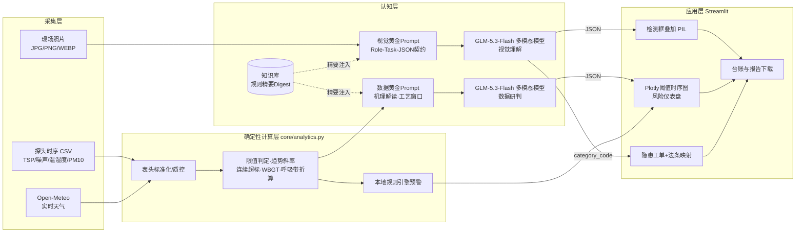

# 🏗️ 尘安智眼 v4 —— 工地环境与安全智能监测系统

> 多模态视觉识别 × 传感器时序研判 × 规范知识库 RAG。面向 “海之子杯” AI 智能体挑战赛的可交互原型。
> 主题：
>
> **为人民建好房，为工友谋幸福**
>
>  —— 一端守法律红线（环保合规），一端守工友健康黄线（职业卫生）。

## 一、它能做什么


| 模块             | 能力                                                                                                                             |
| -------------- | ------------------------------------------------------------------------------------------------------------------------------ |
| 📷 **视觉隐患识别**  | 上传现场照片，视觉大模型按 18 类隐患目录巡检，输出结构化 JSON：隐患定位（归一化 bbox）、危险值 1\~5、置信度、事故链、违反标准、整改时限 / 责任人 / 语音提示；系统在原图叠加红 / 橙 / 黄检测框，并自动召回对应规范全文     |
| 🌡️ **传感器研判**  | 支持 CSV 时序上传 / 在线表格 / 单点速测（含 Open-Meteo 天气自动填充）；程序确定性计算限值判定、趋势斜率、连续超标、WBGT、呼吸带粉尘、背景修正，大模型输出机理解读、多因子耦合、混凝土浇筑与室外作业**工艺窗口**、趋势外推   |
| 📚 **知识库 RAG** | 11 份规范规则（GB16297、GB12523-2025、DB61/1078、GBZ2.1/2.2、安监总安健〔2012〕89 号等）；**默认从 GitHub raw 云端加载**（更新知识库无需重新部署），云端不可达时自动降级本地打包副本；启动时压缩为 “规则精要” 注入，命中隐患后再按需召回全文 |
| 🗂️ **检查台账**   | 视觉 / 数据报告自动归档，支持 Markdown 与结构化 JSON 双格式下载，可作为整改工单                                                                              |
| ▶️ **演示模式**    | 无 API Key / 断网时，内置示例照片（`data/demo_site.jpg`）与示例时序（`data/sample_sensor.csv`）可完整走通全部界面，路演不翻车                                     |

## 二、技术架构




> 单页可打印版本：
>
> `docs/技术架构图.svg`
>
> （浏览器打开即可导出 PDF/PNG）。

## 三、目录结构


```
尘安智眼-重构版/

├── app.py                  # Streamlit 五 Tab 主界面

├── requirements.txt

├── .streamlit/config.toml  # 主题

├── core/

│   ├── config.py           # 限值/分级/18类隐患目录/知识库映射（单一事实来源）

│   ├── prompts.py          # ★ 两套黄金系统提示词（结构化框架 + JSON Schema）

│   ├── knowledge.py        # 本地/GitHub 加载、规则精要压缩、隐患→法条映射、检索

│   ├── analytics.py        # 传感器特征工程（确定性计算，杜绝 LLM 算术幻觉）

│   ├── charts.py           # Plotly 阈值时序图 + 风险仪表盘（缺依赖自动降级）

│   ├── vision\_overlay.py   # PIL 检测框/标签/信息条叠加

│   ├── llm.py              # OpenAI 兼容调用：超时重试/JSON修复/友好报错

│   ├── demo.py             # 离线演示样例

│   └── reporting.py        # JSON → Markdown 报告

├── knowledge/              # 规范知识库（11 份 md，随仓库分发）

├── data/

│   ├── sample\_sensor.csv   # 演示时序（TSP上升超标+噪声超标+高温过程）

│   ├── demo\_site.jpg       # 演示照片

│   └── overlay\_demo.jpg    # 检测框效果示例（测试生成）

└── tests/

&#x20;   ├── smoke\_test.py       # 核心链路离线测试

&#x20;   └── apptest\_smoke.py    # Streamlit AppTest 无头交互测试
```

## 四、快速开始


```
\# 1. 安装依赖（Python 3.10+）

pip install -r requirements.txt

\# 2. 运行

python -m streamlit run app.py

\# 3. 两种使用方式

\#  方式A（推荐路演）：不填 Key，保持“▶️ 演示模式”开启，点击即可体验全流程

\#  方式B（真实分析）：左侧填入智谱开放平台 API Key（或环境变量 ZHIPUAI\_API\_KEY），关闭演示模式
```


* 视觉与数据链路默认均使用 `glm-5.3-flash`（原生多模态、1M 上下文、速度快），可在侧边栏切换 glm-5.3-flashx / glm-5.3 / GLM-4V 等；接口为 OpenAI 兼容协议，替换 Base URL 可接入其他兼容服务。

* 自检：`python tests/smoke_test.py`（核心逻辑）、`python tests/apptest_smoke.py`（界面全链路）。

## 五、5 分钟路演动线（建议）


1. **总览 Tab**：讲工作流（采集→确定性计算→黄金 Prompt→RAG→分级处置闭环）与现行限值表。

2. **视觉 Tab**：直接点 “开始 AI 视觉巡检”（演示图）→ 展示叠加检测框的图片 → 逐条讲隐患工单（危险值 / 事故链 / 整改 / 语音话术）→ 展开 “自动匹配的规范条文”→ 下载 JSON/Markdown。

3. **传感器 Tab**：默认载入示例 CSV → 先看程序确定性预警与 Plotly 阈值图（超标红叉）→ 点 “生成 AI 专业研判报告”→ 讲 WBGT / 呼吸带折算、混凝土浇筑窗口、趋势外推。

4. **知识库 Tab**：搜索 “裸土 / 黑烟”，展示隐患分类→法条映射表。

5. **台账 Tab**：展示两次检查已自动归档，呼应 “闭环管理”。

## 六、知识库云端更新机制（默认 GitHub 云端）

1. 应用启动时默认从 `core/config.py` 的 `GITHUB_KB_HINT`（raw 目录地址）拉取全部规范 md，
   本项目已配置为 `https://raw.githubusercontent.com/lancetselina-art/chen-an-zhi-yan/main/knowledge`；

2. 以后更新知识库：只需把新版 md 提交推送到 GitHub 的 `knowledge/` 目录，访客下次打开应用即自动读到新版，**无需重新部署**；

3. 云端不可达（断网/私有库）时自动降级使用随应用打包的本地副本，不影响演示；

4. 管理员在网址后加 `?admin=1`，可在侧边栏手动 “立即从 GitHub 同步”、修改 raw 地址或切换本地目录；

5. 新增规范按 `序号-名称.md` 命名上传，并在 `core/config.py` 的 `HAZARD_CATALOG` 增加分类映射。

## 七、输出契约（供二次开发对接）


* 视觉：`overall{risk_level,risk_score,disposition,headline}` + `findings[]{category_code,severity,danger_level,confidence,bbox,standard_refs,rectification,...}` + `stats` + `uncertainties`

* 数据：`data_quality` + `metric_reports[]{trend,physical_mechanism,actions}` + `coupled_synthesis` + `process_window{concrete_pouring,outdoor_work}` + `warnings[]` + `forecast` + `report_markdown`

字段定义与 few-shot 样例见 `core/prompts.py`。